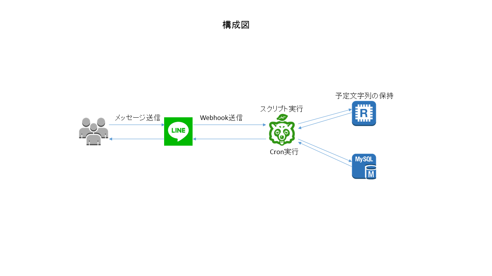
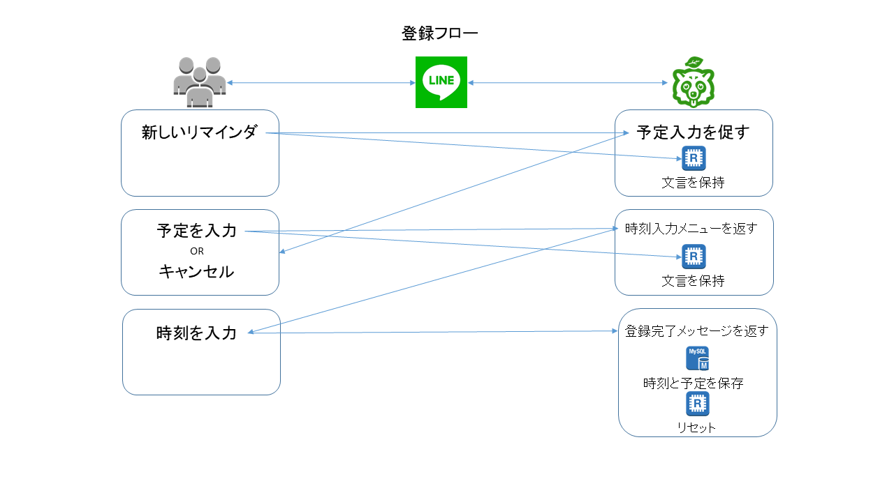
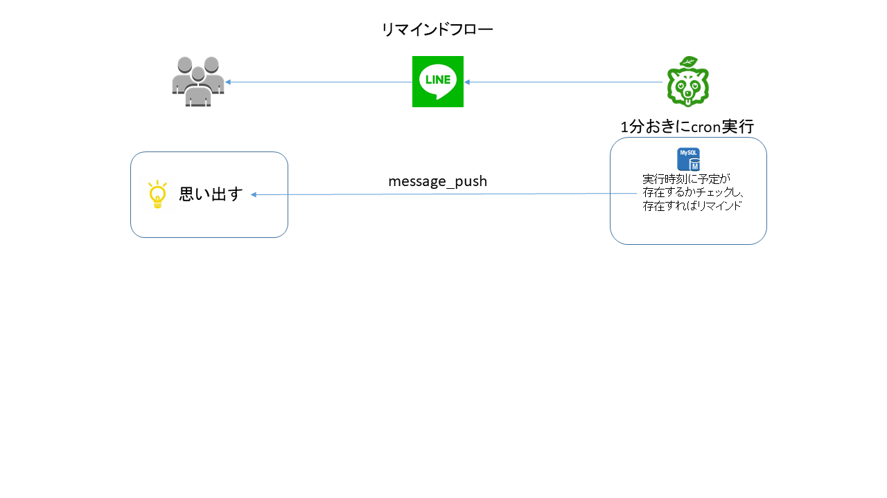

# リマインだぬき

## 概要

事前に何時何分にこの予定をリマインドして欲しいと入力しておくと、その時間になったら通知してくれる予定管理用のLINEボットです。

## 登録方法

LINEアプリで下記のQRコードを読み取って友達登録する。  

## 使い方

1. 通知して欲しい予定を入力。
1. 通知して欲しい時間を設定する。またはキャンセル。
1. 設定した時間になったら通知される。

## OS ミドルウェア

|アーキテクチャ|バージョン等|備考|
|:--|:--|:--:|
|language|python 3.6||
|SDK|line-bot-sdk-python|[Githubリポジトリ](https://github.com/line/line-bot-sdk-python)
|Docker|17.03.2-ce||
|Docker Image|python:alpine3.7||
|Docker Host|Amazon Linux|AWS|
|DB|Amazon RDS|MySQL 5.7|
|Redis|Amazon ElastiCache|Redis|

## 構成図

## フロー

