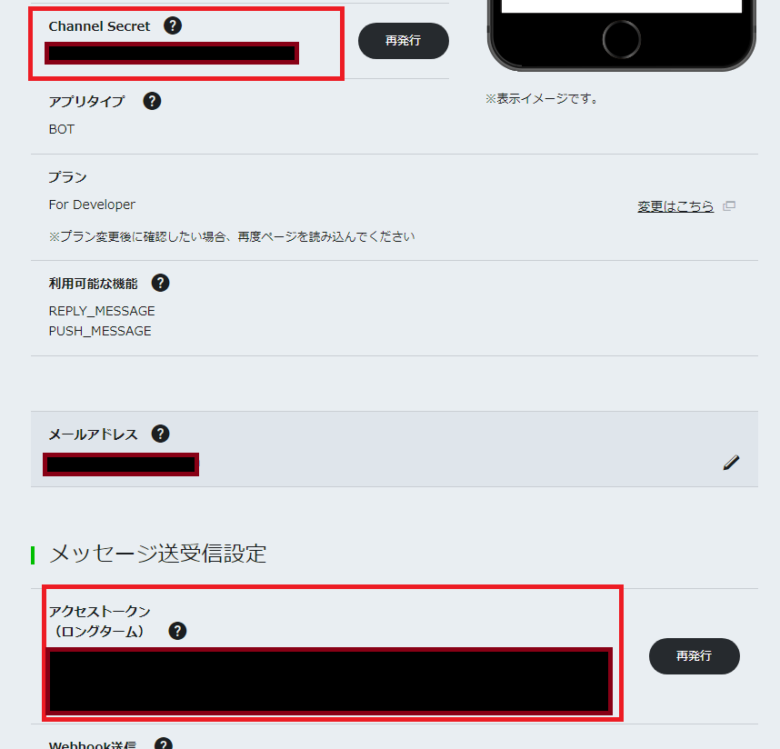
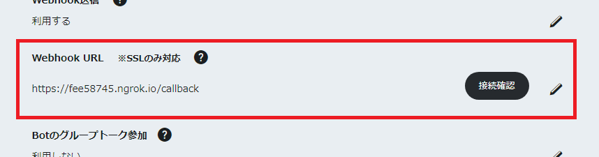

# リマインだぬき(remindanuki)

## 1. 概要

事前に何時何分にこの予定をリマインドして欲しいと入力しておくと、その時間になったら通知してくれる予定管理用のLINEボットです。

## 2. 登録方法

LINEアプリで下記のQRコードを読み取って友達登録する。  


## 3. 使い方

1. 通知して欲しい予定を入力。
1. 通知して欲しい時間を設定する。またはキャンセル。
1. 設定した時間になったら通知される。

## 4. OS ミドルウェア

|アーキテクチャ|バージョン等|備考|
|:--|:--|:--:|
|Host Machine|Amazon Linux|AWS|
|Docker|17.03.2-ce||
|Docker Image|python:alpine3.7</br>mysql:5.7</br>redis:latest||
|language|python 3.6||
|SDK|line-bot-sdk-python|[Githubリポジトリ](https://github.com/line/line-bot-sdk-python)

## 5. 構成図


## 6. フロー


## 7. 実行方法

※コマンド内に出てくるファイル名、ディレクトリパスは自身の環境に合わせて読み替えてください。  

前提条件：

- LINE DevelopersでMessageing APIが利用可能なアカウントを作成済みなこと
- Gitが使える環境であること
- Dockerおよび、docker-composeコマンドの実行環境が揃っていること

### 7-1. Git cloneする

任意のディレクトリにローカルGitリポジトリを作成します。

```
$ cd /path/to/develop
$ git clone git@github.com:Supper-of-Developers/remindanuki.git
```

```
$ cd remindanuki
$ ls -la
total 32
drwxr-xr-x  7 ec2-user ec2-user 4096 Apr 13 07:12 .
drwx------ 12 ec2-user ec2-user 4096 Apr 13 03:22 ..
drwxr-xr-x  3 ec2-user ec2-user 4096 Apr 13 06:56 app
drwxr-xr-x  3 ec2-user ec2-user 4096 Apr 13 02:22 containers
drwxr-xr-x  2 ec2-user ec2-user 4096 Apr 13 07:46 crontabs
drwxr-xr-x  5 ec2-user ec2-user 4096 Apr 13 07:30 data
-rw-rw-r--  1 ec2-user ec2-user 1185 Apr 13 07:29 docker-compose.yml
drwxr-xr-x  2 ec2-user ec2-user 4096 Apr 13 02:22 logs
```

### 7.2 LINE CHANNEL_SECRETとACCESS_TOKENの設定

LINE Developersにログインし、Channel Secretとアクセストークンを確認します。  
アクセストークンは発行してください。



先ほどGitから取得してきた```docker-compose.yml```ファイルを編集し、CHANNEL_SECRETとACCESS_TOKENの設定を行います。  
下記の部分のYOUR_~部分を自身のCHANNEL_SECRETとACCESS_TOKENに書き換えてください。

```
remindanuki:
    ~省略~
    environment:
      - CHANNEL_SECRET=YOUR_CHANNEL_SECRET
      - ACCESS_TOKEN=YOUR_ACCESS_TOKEN
    ~省略~
```

### 7-3. コンテナのビルド＆起動

docker-composeコマンドでコンテナをビルドします。

```
$ docker-compose build
```

起動オプションに```-d``` を付けてバックグラウンドで実行させます。  
初回はmysqlとredisのイメージを取得してくるのでちょっと時間がかかります。

```
$ docker-compose up -d
```

remindanuki,mysql,redisのそれぞれのコンテナが立ち上がっていれば成功です。

```
$ docker ps
CONTAINER ID        IMAGE                     COMMAND                  CREATED             STATUS              PORTS                     NAMES
4edf97d6c557        remindanuki_remindanuki   "/bin/sh -c 'crond &…"   2 seconds ago       Up 2 seconds        0.0.0.0:3000->3000/tcp    remindanuki_remindanuki_1
d8d165a7ca0f        mysql:5.7                 "docker-entrypoint.s…"   3 seconds ago       Up 2 seconds        0.0.0.0:13306->3306/tcp   remindanuki_db_1
ee700e83b807        redis:latest              "docker-entrypoint.s…"   2 seconds ago         Up 2 seconds        0.0.0.0:6379->6379/tcp    remindanuki_redis_1
```

### 7-4. ngrokのダウンロードと起動

HTTPS化させるためにngrokを利用するため、インストールを行います。  
[ngrokのサイト](https://ngrok.com/download)から自分の環境に合わせてダウンロードし、任意のディレクトリに配置してください。  
配置出来たらzipを解凍し、ngrokをポート3000番にフォワーディングするように起動します。  

```
$ cd /path/to/ngrok.zip
$ unzip ngrok.zip
$ ./ngrok http 3000
```

### 7-5. LINE Webhook URLの設定

LINE Developers画面でWebhook URLの設定の設定部分に```ngrokのURL/callback```と記載してください。



設定後、ボットにメッセージを送信して無事に動作していればOK。
